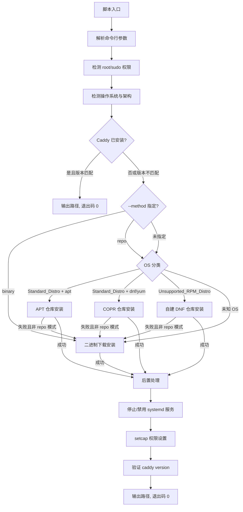
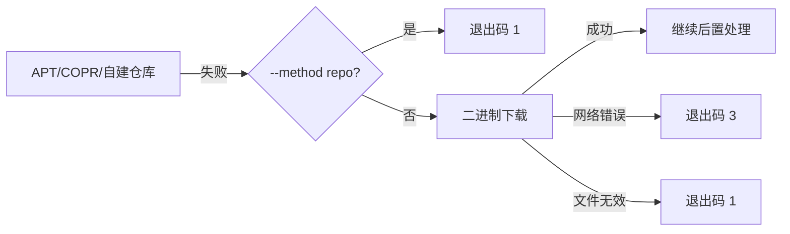

# 技术设计文档：Caddy Server 中国发行版安装脚本

## 概述

本设计描述一个纯 Bash 安装脚本 `install-caddy.sh`，用于在多种 Linux 发行版（包括中国国产发行版）上安装 Caddy Server。脚本采用三级 fallback 安装策略：

1. **官方包仓库**（APT / COPR）— 适用于标准发行版
2. **自建 DNF 仓库**（Self_Hosted_Repo）— 适用于 COPR 不支持的 RPM 系发行版
3. **官方 API 静态二进制下载**（Caddy_Download_API）— 终极 fallback

脚本作为 WebCasa 项目的外部依赖被调用，需遵循严格的退出码和输出约定，确保程序化集成。

### 设计决策

- **纯 Bash 实现**：无外部语言依赖，最大化兼容性。Bash 4.0+ 是目标环境的合理最低要求。
- **函数化组织**：每个主要功能封装为独立函数，便于测试和维护。
- **自建 DNF 仓库替代 COPR**：COPR 不支持 openEuler、Anolis 等中国国产发行版，自建仓库通过 EPEL 版本映射解决兼容性问题。
- **多级 fallback**：包仓库失败时自动回退到二进制下载，确保安装成功率。
- **stdout 仅输出机器可读结果**：日志全部走 stderr，stdout 最后一行输出 Caddy 路径，方便 WebCasa 程序化解析。

## 架构

### 整体流程



### 模块划分

脚本按功能划分为以下模块（均为 Bash 函数）：

| 模块 | 函数前缀 | 职责 |
|------|---------|------|
| 参数解析 | `parse_` | 解析命令行参数，设置全局变量 |
| OS 检测 | `detect_` | 读取 os-release，分类 OS，检测架构 |
| 已安装检测 | `check_` | 检测 Caddy 是否已安装，版本比较 |
| APT 安装 | `install_apt_` | 官方 APT 仓库安装流程 |
| COPR 安装 | `install_copr_` | 官方 COPR 仓库安装流程 |
| 自建仓库安装 | `install_selfhosted_` | 自建 DNF 仓库安装流程 |
| 二进制安装 | `install_binary_` | 官方 API 二进制下载安装 |
| 后置处理 | `post_` | systemd 服务处理、setcap、验证 |
| 工具函数 | `util_` | 日志输出、颜色控制、错误处理、清理 |

## 组件与接口

### 1. 参数解析模块

```bash
# 全局变量（参数解析结果）
OPT_VERSION=""          # --version 指定的目标版本
OPT_METHOD=""           # --method: "repo" | "binary" | ""（自动）
OPT_PREFIX="/usr/local/bin"  # --prefix: 二进制安装目录
OPT_MIRROR=""           # --mirror: 镜像地址
OPT_SKIP_SERVICE=false  # --skip-service
OPT_SKIP_CAP=false      # --skip-cap
OPT_YES=false           # -y/--yes
```

**函数接口：**

- `parse_args "$@"` — 解析所有命令行参数，设置全局变量。遇到未知参数时输出错误并退出码 1。
- `parse_show_help` — 输出帮助信息并退出码 0。

### 2. OS 检测模块

```bash
# 全局变量（OS 检测结果）
OS_ID=""                # /etc/os-release 中的 ID
OS_ID_LIKE=""           # /etc/os-release 中的 ID_LIKE
OS_VERSION_ID=""        # /etc/os-release 中的 VERSION_ID
OS_NAME=""              # /etc/os-release 中的 NAME
OS_PLATFORM_ID=""       # /etc/os-release 中的 PLATFORM_ID
OS_CLASS=""             # "standard_deb" | "standard_rpm" | "unsupported_rpm" | "unknown"
OS_ARCH=""              # "amd64" | "arm64" | "loongarch64" | "riscv64"
OS_ARCH_RAW=""          # uname -m 原始值
EPEL_VERSION=""         # EPEL 兼容版本: "8" | "9"
PKG_MANAGER=""          # "apt" | "dnf" | "yum"
```

**函数接口：**

- `detect_os` — 读取 `/etc/os-release`，设置 OS_ID、OS_ID_LIKE 等变量。文件不存在时退出码 2。
- `detect_arch` — 检测 CPU 架构，映射到 Caddy 下载 API 的架构名。不支持的架构退出码 2。
- `detect_classify` — 根据 OS_ID 和 ID_LIKE 分类 OS，设置 OS_CLASS 和 EPEL_VERSION。
- `detect_pkg_manager` — 检测可用的包管理器（apt/dnf/yum）。

**EPEL 版本映射逻辑：**

```
openEuler       → 根据 VERSION_ID 主版本: 20.03/22.03 → EPEL 8, 24.03+ → EPEL 9
anolis / alinux → 根据 VERSION_ID 主版本: 8.x → EPEL 8, 23.x → EPEL 9
opencloudos     → 根据 VERSION_ID 主版本: 8.x → EPEL 8, 9.x → EPEL 9
kylin           → 根据 PLATFORM_ID 或 VERSION_ID 推断: V10 → EPEL 8
amzn (2023)     → EPEL 9
ol              → 根据 VERSION_ID 主版本: 8.x → EPEL 8, 9.x → EPEL 9
```

### 3. 已安装检测模块

**函数接口：**

- `check_installed` — 通过 `command -v caddy` 检测。返回 0 表示已安装，1 表示未安装。
- `check_version_match` — 比较已安装版本与 OPT_VERSION。返回 0 表示匹配，1 表示不匹配。

### 4. APT 安装模块

**函数接口：**

- `install_apt_repo` — 完整的 APT 仓库安装流程：安装依赖 → 导入 GPG 密钥 → 配置源 → apt-get update → apt-get install caddy。失败时返回非零。

**关键实现细节：**
- GPG 密钥存储路径：`/usr/share/keyrings/caddy-stable-archive-keyring.gpg`
- APT 源文件：`/etc/apt/sources.list.d/caddy-stable.list`
- 源格式：`deb [signed-by=...] https://dl.cloudsmith.io/public/caddy/stable/deb/debian any-version main`

### 5. COPR 安装模块

**函数接口：**

- `install_copr_repo` — 完整的 COPR 仓库安装流程：安装 copr 插件 → 启用 @caddy/caddy → dnf install caddy。失败时返回非零。

### 6. 自建 DNF 仓库安装模块

**函数接口：**

- `install_selfhosted_repo` — 完整的自建仓库安装流程：写入 .repo 文件 → 导入 GPG 密钥 → dnf/yum install caddy。失败时返回非零。

**仓库 URL 结构：**

```
{MIRROR_BASE_URL}/caddy/{epel_version}/{arch}/
```

- `MIRROR_BASE_URL`：默认值或 `--mirror` 指定的地址
- `epel_version`：`8` 或 `9`（由 EPEL 版本映射决定）
- `arch`：`x86_64` 或 `aarch64`（使用原始架构名）

**repo 文件模板：**

```ini
[caddy-selfhosted]
name=Caddy Self-Hosted Repository (EPEL $EPEL_VERSION - $ARCH)
baseurl={MIRROR_BASE_URL}/caddy/{epel_version}/{arch}/
enabled=1
gpgcheck=1
gpgkey={MIRROR_BASE_URL}/caddy/gpg.key
```

### 7. 二进制下载安装模块

**函数接口：**

- `install_binary_download` — 通过 Caddy_Download_API 下载二进制文件：构造 URL → curl 下载 → 校验 → 安装到 OPT_PREFIX → chmod +x。

**下载 URL 构造：**

```
https://caddyserver.com/api/download?os=linux&arch={OS_ARCH}[&version={OPT_VERSION}]
```

**curl 参数：**
- `--connect-timeout 30`
- `--max-time 120`
- `-fSL`（fail silently on HTTP errors, show errors, follow redirects）
- `-o {temp_file}`

### 8. 后置处理模块

**函数接口：**

- `post_disable_service` — 检测并停止/禁用 caddy.service。systemctl 不可用时跳过。
- `post_set_capabilities` — 对 Caddy 二进制执行 setcap。setcap 不可用或失败时仅警告。
- `post_verify` — 执行 `caddy version` 验证安装。失败时退出码 1。

### 9. 工具函数模块

**函数接口：**

- `util_log_info "message"` — 蓝色信息日志到 stderr
- `util_log_success "message"` — 绿色成功日志到 stderr
- `util_log_warn "message"` — 黄色警告日志到 stderr
- `util_log_error "message"` — 红色错误日志到 stderr
- `util_check_root` — 检测 root 权限或 sudo 可用性，不足时退出码 4
- `util_cleanup` — 清理临时文件（trap handler）
- `util_has_color` — 检测 stderr 是否为终端，决定是否启用彩色输出

## 数据模型

本项目为纯 Bash 脚本，不涉及持久化数据存储。核心数据结构为全局 Shell 变量：

### 全局状态变量

```bash
# === 参数解析结果 ===
OPT_VERSION=""              # 目标版本号（如 "2.7.6"），空表示最新
OPT_METHOD=""               # 安装方式: "repo" | "binary" | ""
OPT_PREFIX="/usr/local/bin" # 二进制安装目录
OPT_MIRROR=""               # 自建仓库镜像地址
OPT_SKIP_SERVICE=false      # 是否跳过 systemd 服务处理
OPT_SKIP_CAP=false          # 是否跳过 setcap
OPT_YES=false               # 是否自动确认

# === OS 检测结果 ===
OS_ID=""                    # 发行版 ID（如 "openEuler", "ubuntu"）
OS_ID_LIKE=""               # 兼容 ID（如 "rhel centos fedora"）
OS_VERSION_ID=""            # 版本号（如 "22.03", "9"）
OS_NAME=""                  # 发行版全名
OS_PLATFORM_ID=""           # 平台 ID
OS_CLASS=""                 # 分类: "standard_deb" | "standard_rpm" | "unsupported_rpm" | "unknown"
OS_ARCH=""                  # 标准化架构: "amd64" | "arm64"
OS_ARCH_RAW=""              # 原始架构: "x86_64" | "aarch64"
EPEL_VERSION=""             # EPEL 兼容版本: "8" | "9"
PKG_MANAGER=""              # 包管理器: "apt" | "dnf" | "yum"

# === 运行时状态 ===
CADDY_BIN=""                # 安装后的 Caddy 二进制路径
INSTALL_METHOD_USED=""      # 实际使用的安装方式
TEMP_DIR=""                 # 临时目录路径（用于清理）
USE_COLOR=true              # 是否启用彩色输出
```

### 退出码定义

| 退出码 | 含义 | 触发场景 |
|--------|------|---------|
| 0 | 成功 | 安装成功或已安装且版本匹配 |
| 1 | 一般性失败 | 安装失败、验证失败、未知参数 |
| 2 | 环境不支持 | OS 不支持、架构不支持、os-release 缺失 |
| 3 | 网络错误 | 连接超时、下载超时、DNS 失败 |
| 4 | 权限不足 | 非 root 且无 sudo |

### OS 分类映射表

| OS_ID | 条件 | OS_CLASS | EPEL_VERSION |
|-------|------|----------|-------------|
| debian, ubuntu | — | standard_deb | — |
| fedora, centos, rhel, almalinux, rocky | — | standard_rpm | — |
| openEuler | — | unsupported_rpm | 按版本映射 |
| anolis | — | unsupported_rpm | 按版本映射 |
| alinux | — | unsupported_rpm | 按版本映射 |
| opencloudos | — | unsupported_rpm | 按版本映射 |
| kylin | ID_LIKE 含 rhel/centos/fedora | unsupported_rpm | 按版本映射 |
| amzn | VERSION_ID=2023 | unsupported_rpm | 9 |
| ol | — | unsupported_rpm | 按主版本映射 |
| 其他 | — | unknown | — |

## 正确性属性（Correctness Properties）

*属性（Property）是系统在所有有效执行中都应保持为真的特征或行为——本质上是对系统应做什么的形式化陈述。属性是人类可读规范与机器可验证正确性保证之间的桥梁。*

### Property 1: os-release 字段提取正确性

*For any* 包含 `ID`、`ID_LIKE`、`VERSION_ID`、`NAME`、`PLATFORM_ID` 字段的 `/etc/os-release` 文件内容，`detect_os` 函数解析后设置的全局变量值应与文件中对应字段的值完全一致。

**Validates: Requirements 1.1**

### Property 2: OS 分类正确性

*For any* OS_ID 和 ID_LIKE 组合，`detect_classify` 函数应产生正确的 OS_CLASS 值：标准 Debian 系 ID 映射到 `standard_deb`，标准 RPM 系 ID 映射到 `standard_rpm`，已知的不支持 COPR 的 RPM 系 ID（满足附加条件）映射到 `unsupported_rpm`，其他所有 ID 映射到 `unknown`。

**Validates: Requirements 1.2, 1.3, 1.8**

### Property 3: 架构检测与映射正确性

*For any* `uname -m` 返回的架构字符串，`detect_arch` 函数应将 `x86_64` 映射到 `amd64`、`aarch64` 映射到 `arm64`，将 `loongarch64` 和 `riscv64` 标记为可选支持架构并继续，对所有其他未知架构字符串返回退出码 2。

**Validates: Requirements 1.9, 1.10, 1.11**

### Property 4: EPEL 版本映射正确性

*For any* Unsupported_RPM_Distro 的 OS_ID 和 VERSION_ID 组合，`detect_classify` 函数应根据映射规则产生正确的 EPEL_VERSION 值（`8` 或 `9`）。

**Validates: Requirements 1.4, 1.5, 1.6, 5.2**

### Property 5: 版本比较正确性

*For any* 两个语义化版本字符串，`check_version_match` 函数应在版本一致时返回 0（跳过安装），版本不一致时返回 1（继续安装）。

**Validates: Requirements 2.3, 2.4**

### Property 6: 安装方式路由正确性

*For any* OS_CLASS 和 OPT_METHOD 组合，脚本应选择正确的安装方式：`OPT_METHOD="binary"` 时直接二进制下载；`standard_deb` 使用 APT；`standard_rpm` 使用 COPR；`unsupported_rpm` 使用自建仓库；`unknown` 使用二进制下载。

**Validates: Requirements 3.1, 4.1, 5.1, 6.1**

### Property 7: 包仓库失败自动回退

*For any* 包仓库安装失败的情况，当 `OPT_METHOD` 不为 `"repo"` 时，脚本应自动回退到 Caddy_Download_API 二进制下载方式；当 `OPT_METHOD="repo"` 时，不应回退而直接以失败退出。

**Validates: Requirements 3.6, 4.5, 5.7**

### Property 8: 命令行参数解析正确性

*For any* 有效的命令行参数组合，`parse_args` 函数应正确设置对应的全局变量（OPT_VERSION、OPT_METHOD、OPT_PREFIX、OPT_MIRROR、OPT_SKIP_SERVICE、OPT_SKIP_CAP、OPT_YES）；*For any* 未知参数字符串，`parse_args` 应以退出码 1 终止。

**Validates: Requirements 7.1, 7.2, 7.5, 7.6, 7.11**

### Property 9: 二进制下载 URL 构造正确性

*For any* OS_ARCH 和 OPT_VERSION 组合，`install_binary_download` 构造的下载 URL 应包含正确的 `os=linux` 和 `arch={OS_ARCH}` 参数，当 OPT_VERSION 非空时还应包含 `version={OPT_VERSION}` 参数，且二进制文件目标路径应为 `{OPT_PREFIX}/caddy`。

**Validates: Requirements 6.2, 6.3, 6.4**

### Property 10: APT 源文件内容正确性

*For any* 镜像地址配置（默认或 `--mirror` 指定），生成的 APT 源文件内容应包含正确的 `signed-by` 密钥路径、正确的仓库 URL、`any-version` 作为 distribution、`main` 作为 component。

**Validates: Requirements 3.4**

### Property 11: 自建 DNF 仓库配置文件正确性

*For any* EPEL_VERSION、OS_ARCH_RAW 和 OPT_MIRROR 组合，生成的 `.repo` 文件应包含正确的 `baseurl`（格式为 `{mirror}/{epel_version}/{arch}/`）、`gpgcheck=1`、正确的 `gpgkey` URL。

**Validates: Requirements 5.3, 5.6, 5.8**

### Property 12: 退出码映射正确性

*For any* 错误类别，脚本的退出码应与定义的映射一致：成功→0，一般性失败→1，环境不支持→2，网络错误→3，权限不足→4。

**Validates: Requirements 10.1, 10.2, 10.3, 10.4, 10.5, 13.5**

### Property 13: 日志输出规范性

*For any* 日志函数调用（util_log_info、util_log_success、util_log_warn、util_log_error），输出应写入 stderr 而非 stdout；当 USE_COLOR=true 时应包含对应的 ANSI 颜色转义序列（蓝/绿/黄/红），当 USE_COLOR=false 时不应包含任何 ANSI 转义序列。

**Validates: Requirements 10.7, 10.8, 10.9**

### Property 14: stdout 输出格式正确性

*For any* 成功的安装路径，脚本 stdout 的最后一行应为 Caddy 二进制文件的绝对路径（以 `/` 开头）。

**Validates: Requirements 10.6**

### Property 15: 网络超时配置正确性

*For any* 脚本中构造的 curl 命令，应包含 `--connect-timeout 30` 和 `--max-time 120` 参数。

**Validates: Requirements 12.1, 12.2**

### Property 16: 网络错误诊断信息

*For any* curl 失败退出码，脚本应输出对应的具体错误描述（DNS 解析失败、连接超时、SSL 错误等）到 stderr。

**Validates: Requirements 12.4**

## 错误处理

### 错误分类与处理策略

| 错误类别 | 退出码 | 处理策略 |
|---------|--------|---------|
| os-release 缺失 | 2 | 立即终止，输出错误到 stderr |
| 不支持的架构 | 2 | 立即终止，输出错误到 stderr |
| 权限不足 | 4 | 立即终止，提示需要 root 或 sudo |
| 包仓库安装失败 | — | 自动回退到二进制下载（除非 `--method repo`） |
| 二进制下载网络错误 | 3 | 终止，输出具体网络错误原因 |
| 下载文件无效 | 1 | 删除无效文件，终止 |
| caddy version 验证失败 | 1 | 终止，提示安装可能损坏 |
| systemctl 不可用 | — | 跳过服务处理，输出提示到 stderr |
| setcap 不可用/失败 | — | 仅输出警告，不终止 |
| 未知参数 | 1 | 终止，输出帮助提示 |
| SIGINT/SIGTERM | 非零 | 清理临时文件后退出 |

### Fallback 链路



### 信号处理

脚本通过 `trap` 注册 `SIGINT`（Ctrl+C）和 `SIGTERM` 信号处理器：

```bash
trap util_cleanup EXIT
trap 'util_log_error "收到中断信号，正在清理..."; exit 130' INT TERM
```

`util_cleanup` 函数负责删除 `TEMP_DIR` 中的所有临时文件。

### curl 错误码映射

| curl 退出码 | 错误描述 | 脚本退出码 |
|------------|---------|-----------|
| 6 | DNS 解析失败 | 3 |
| 7 | 连接被拒绝 | 3 |
| 28 | 连接超时 | 3 |
| 35 | SSL 握手失败 | 3 |
| 22 | HTTP 错误（4xx/5xx） | 3 |
| 其他 | 未知网络错误 | 3 |

## 测试策略

### 测试框架选择

- **单元测试**：使用 [bats-core](https://github.com/bats-core/bats-core)（Bash Automated Testing System）
- **属性测试**：使用 bats-core 配合自定义随机数据生成器实现属性测试循环（Bash 生态无成熟的 PBT 库，通过循环 100 次随机输入模拟属性测试）

> 注：由于 Bash 生态缺乏原生的属性测试（Property-Based Testing）库，我们采用 bats-core 测试框架，在每个属性测试中通过循环生成随机输入并验证属性。每个属性测试至少运行 100 次迭代。

### 测试组织

```
tests/
├── test_helper/
│   ├── generators.bash    # 随机数据生成器（OS_ID、版本号、架构等）
│   └── mock_helpers.bash  # Mock 工具（模拟 os-release、命令等）
├── unit/
│   ├── test_parse_args.bats       # 参数解析单元测试
│   ├── test_detect_os.bats        # OS 检测单元测试
│   ├── test_detect_arch.bats      # 架构检测单元测试
│   ├── test_check_installed.bats  # 已安装检测单元测试
│   ├── test_url_construction.bats # URL 构造单元测试
│   ├── test_repo_generation.bats  # 仓库配置生成单元测试
│   ├── test_log_functions.bats    # 日志函数单元测试
│   └── test_exit_codes.bats       # 退出码单元测试
└── property/
    ├── test_prop_os_classify.bats      # Property 2: OS 分类
    ├── test_prop_arch_detect.bats      # Property 3: 架构检测
    ├── test_prop_epel_mapping.bats     # Property 4: EPEL 映射
    ├── test_prop_version_compare.bats  # Property 5: 版本比较
    ├── test_prop_routing.bats          # Property 6: 安装路由
    ├── test_prop_fallback.bats         # Property 7: 回退逻辑
    ├── test_prop_parse_args.bats       # Property 8: 参数解析
    ├── test_prop_url_build.bats        # Property 9: URL 构造
    ├── test_prop_apt_source.bats       # Property 10: APT 源生成
    ├── test_prop_dnf_repo.bats         # Property 11: DNF 仓库配置
    ├── test_prop_exit_codes.bats       # Property 12: 退出码映射
    ├── test_prop_log_output.bats       # Property 13: 日志输出
    ├── test_prop_stdout_format.bats    # Property 14: stdout 格式
    ├── test_prop_curl_timeout.bats     # Property 15: 网络超时
    └── test_prop_curl_errors.bats      # Property 16: 网络错误诊断
```

### 单元测试覆盖

单元测试聚焦于具体示例、边界情况和错误条件：

- **参数解析**：各参数的正确解析、未知参数拒绝、`--help` 输出
- **OS 检测**：各已知发行版的具体检测结果、os-release 缺失处理
- **EPEL 映射**：Amazon Linux 2023 → EPEL 9、Oracle Linux 8/9 映射等边界情况
- **架构检测**：loongarch64/riscv64 可选支持、未知架构拒绝
- **已安装检测**：caddy 存在/不存在、版本匹配/不匹配
- **systemd 处理**：systemctl 可用/不可用、服务运行/停止/禁用状态
- **setcap 处理**：setcap 可用/不可用、执行成功/失败
- **信号处理**：SIGINT/SIGTERM 触发清理

### 属性测试覆盖

每个属性测试对应设计文档中的一个 Correctness Property，通过循环 100 次随机输入验证：

- 每个测试文件头部注释标注对应的属性编号和描述
- 标签格式：`# Feature: caddy-installer-china, Property {N}: {property_text}`
- 随机数据生成器在 `test_helper/generators.bash` 中集中管理
- 生成器覆盖：随机 OS_ID、随机版本号、随机架构字符串、随机 URL、随机参数组合

### 测试执行

```bash
# 运行所有测试
bats tests/

# 仅运行单元测试
bats tests/unit/

# 仅运行属性测试
bats tests/property/

# 运行特定测试文件
bats tests/property/test_prop_os_classify.bats
```

### 测试隔离策略

- 所有文件系统操作使用临时目录（`mktemp -d`），测试后清理
- 通过 `PATH` 操作和 wrapper 函数 mock 外部命令（curl、apt-get、dnf、systemctl 等）
- 每个测试用例独立设置和清理全局变量
- 不依赖真实的网络连接或包管理器
