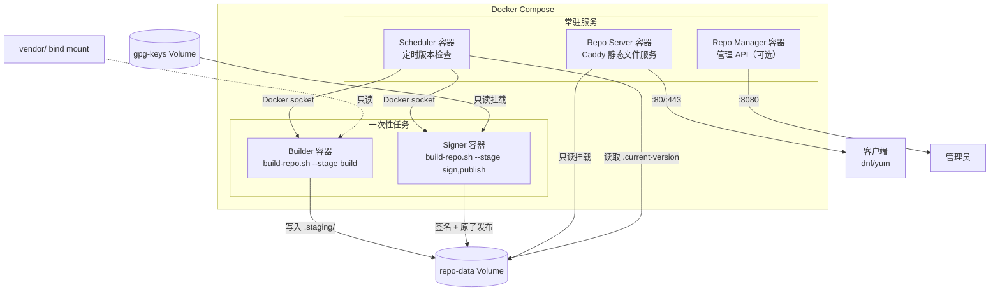
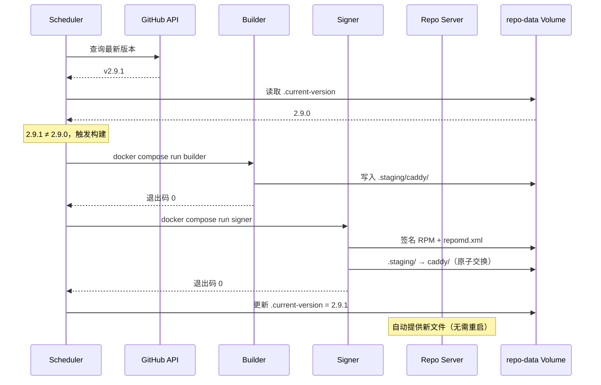
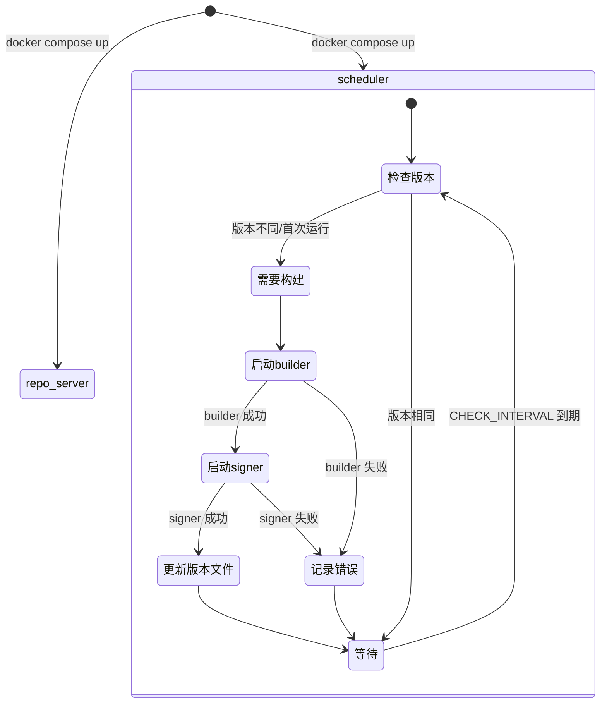
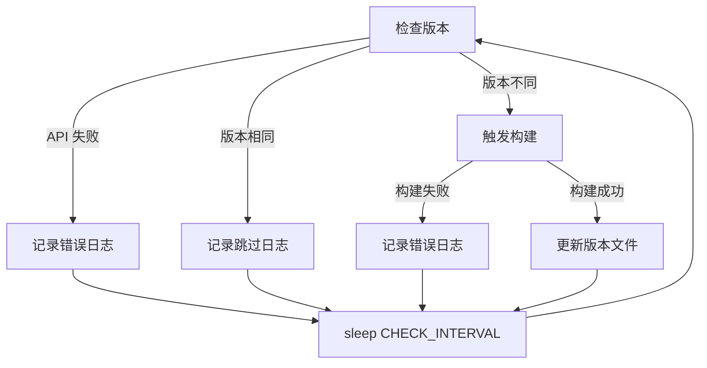
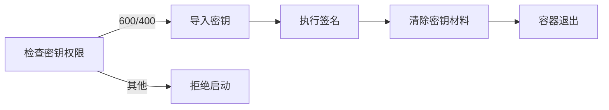

# 技术设计文档：Docker 容器化 RPM 仓库构建系统

## 概述

本设计将现有的 `build-repo.sh` 自建 RPM 仓库构建系统容器化，拆分为 5 个职责单一的 Docker 容器，通过 Docker Compose 编排。系统复用现有的 `build-repo.sh` 脚本（通过 `--stage` 参数分阶段执行），容器仅作为执行环境和编排层，不重写构建逻辑。

### 核心设计理念

- **职责分离**：构建（builder）、签名（signer）、服务（repo-server）、调度（scheduler）、管理（repo-manager）各自独立
- **密钥隔离**：GPG 密钥仅在 signer 容器中可见，builder 和 repo-server 无法访问
- **最小权限**：所有容器以非 root 用户运行，builder/signer 使用只读文件系统
- **复用现有脚本**：容器内直接调用 `build-repo.sh --stage build|sign|publish`，不重复实现构建逻辑
- **无人值守更新**：scheduler 容器按可配置周期自动检查新版本并触发构建

### 设计决策

| 决策 | 选择 | 理由 |
|------|------|------|
| Web 服务器 | Caddy（官方镜像） | 自动 HTTPS、零配置 TLS、与项目主题一致 |
| 管理 API 语言 | Bash + socat/ncat | 保持纯 Bash 技术栈，避免引入额外语言运行时 |
| 容器编排 | Docker Compose v2 | 轻量、适合单机部署、支持 depends_on 条件 |
| scheduler 实现 | Bash 脚本 + sleep 循环 | 无需 cron 依赖，容器化友好，日志直接输出到 stdout/stderr |
| 构建触发方式 | scheduler 通过 Docker socket 启动容器 | 避免 HTTP API 依赖，直接使用 Docker CLI |
| 版本状态存储 | 文件（`.current-version`） | 简单可靠，无需数据库，持久化在 Volume 中 |

## 架构

### 系统架构图



### 数据流



### 容器生命周期



### 目录结构

```
docker/
├── docker-compose.yml          # 主编排文件
├── docker-compose.ci.yml       # CI/CD 覆盖文件
├── .env.example                # 环境变量模板
├── builder/
│   └── Dockerfile              # Builder 容器镜像
├── signer/
│   └── Dockerfile              # Signer 容器镜像
├── scheduler/
│   ├── Dockerfile              # Scheduler 容器镜像
│   └── scheduler.sh            # 定时检查脚本
├── repo-manager/
│   ├── Dockerfile              # Repo Manager 容器镜像
│   └── manager.sh              # 管理 API 脚本
├── repo-server/
│   └── Caddyfile               # Caddy 配置文件
└── README.md                   # 使用文档
```

## 组件与接口

### 1. Builder 容器

**Dockerfile（多阶段构建）：**

```dockerfile
# 阶段 1：安装 nfpm
FROM fedora:41 AS nfpm-installer
RUN dnf install -y golang && \
    go install github.com/goreleaser/nfpm/v2/cmd/nfpm@latest && \
    dnf clean all

# 阶段 2：运行时环境
FROM fedora:41
RUN dnf install -y createrepo_c curl rpm-build rpm-sign gnupg2 && \
    dnf clean all && \
    useradd -r -m -s /sbin/nologin builder
COPY --from=nfpm-installer /root/go/bin/nfpm /usr/local/bin/nfpm
COPY build-repo.sh /app/build-repo.sh
COPY packaging/ /app/packaging/
USER builder
WORKDIR /app
ENTRYPOINT ["bash", "build-repo.sh", "--stage", "build"]
```

**环境变量接口：**

| 变量名 | 说明 | 默认值 | 必填 |
|--------|------|--------|------|
| CADDY_VERSION | Caddy 版本号 | （自动查询） | 否 |
| TARGET_ARCH | 目标架构 | all | 否 |
| TARGET_DISTRO | 目标发行版 | all | 否 |
| BASE_URL | .repo 模板基础 URL | https://rpms.example.com | 否 |

**Volume 挂载：**

| 挂载点 | Volume | 权限 |
|--------|--------|------|
| /repo | repo-data | 读写 |
| /app/vendor | vendor/ bind mount | 只读（可选） |

**入口命令映射：**

```bash
# 容器 ENTRYPOINT 将环境变量转换为 build-repo.sh 参数
bash build-repo.sh --stage build \
    --version "${CADDY_VERSION}" \
    --arch "${TARGET_ARCH:-all}" \
    --distro "${TARGET_DISTRO:-all}" \
    --base-url "${BASE_URL:-https://rpms.example.com}" \
    --output /repo
```

### 2. Signer 容器

**Dockerfile：**

```dockerfile
FROM fedora:41
RUN dnf install -y gnupg2 rpm-sign && \
    dnf clean all && \
    useradd -r -m -s /sbin/nologin signer
COPY build-repo.sh /app/build-repo.sh
COPY packaging/ /app/packaging/
USER signer
WORKDIR /app
ENTRYPOINT ["bash", "build-repo.sh"]
```

**环境变量接口：**

| 变量名 | 说明 | 默认值 | 必填 |
|--------|------|--------|------|
| GPG_KEY_ID | GPG 密钥 ID | — | 是 |

**Volume 挂载：**

| 挂载点 | Volume | 权限 |
|--------|--------|------|
| /repo | repo-data | 读写 |
| /gpg-keys | gpg-keys | 只读 |

**入口命令：**

```bash
# 导入 GPG 密钥 → 签名 → 发布
gpg --import /gpg-keys/*.gpg
bash build-repo.sh --stage sign --gpg-key-id "${GPG_KEY_ID}" --output /repo
bash build-repo.sh --stage publish --output /repo
# 清除 GPG 密钥材料
gpgconf --kill gpg-agent
rm -rf ~/.gnupg
```

**GPG 密钥权限检查（entrypoint 脚本）：**

```bash
# 检查密钥文件权限
for key_file in /gpg-keys/*.gpg; do
    perms=$(stat -c '%a' "$key_file")
    if [[ "$perms" != "600" && "$perms" != "400" ]]; then
        echo "[ERROR] GPG 密钥文件权限不安全: $key_file (当前: $perms，要求: 600 或 400)" >&2
        exit 1
    fi
done
```

### 3. Repo Server 容器

**基于官方 Caddy 镜像，仅添加自定义 Caddyfile：**

```dockerfile
FROM caddy:2-alpine
COPY repo-server/Caddyfile /etc/caddy/Caddyfile
```

**Caddyfile 配置：**

```caddyfile
{$DOMAIN_NAME:localhost} {
    root * /srv/repo
    file_server browse

    # repomd.xml 不缓存，确保客户端获取最新元数据
    @repomd path */repodata/repomd.xml
    header @repomd Cache-Control "no-cache, must-revalidate"

    # RPM 包文件缓存 1 天
    @rpm path *.rpm
    header @rpm Cache-Control "max-age=86400"

    # 访问日志
    log {
        output stdout
        format json
    }
}
```

**Volume 挂载：**

| 挂载点 | Volume | 权限 |
|--------|--------|------|
| /srv/repo | repo-data | 只读 |

**端口映射：** 80（HTTP）、443（HTTPS）

### 4. Scheduler 容器

**scheduler.sh 核心逻辑：**

```bash
#!/usr/bin/env bash
set -euo pipefail

# 解析 CHECK_INTERVAL 环境变量为秒数
parse_interval() {
    local interval="$1"
    case "$interval" in
        *d) echo $(( ${interval%d} * 86400 )) ;;
        *h) echo $(( ${interval%h} * 3600 )) ;;
        *)  echo "$interval" ;;
    esac
}

# 查询 GitHub 最新版本
get_latest_version() {
    local api_url="https://api.github.com/repos/caddyserver/caddy/releases/latest"
    local curl_args=(-fsSL)
    [[ -n "${GITHUB_TOKEN:-}" ]] && curl_args+=(-H "Authorization: token ${GITHUB_TOKEN}")
    curl "${curl_args[@]}" "$api_url" | grep '"tag_name"' | sed 's/.*"v\(.*\)".*/\1/'
}

# 读取当前版本
get_current_version() {
    local version_file="/repo/caddy/.current-version"
    [[ -f "$version_file" ]] && cat "$version_file" || echo ""
}

# 触发构建
trigger_build() {
    local version="$1"
    docker compose run --rm -e CADDY_VERSION="$version" builder
    docker compose run --rm -e CADDY_VERSION="$version" signer
}

INTERVAL_SECONDS=$(parse_interval "${CHECK_INTERVAL:-10d}")
FIRST_RUN=true

while true; do
    if [[ "$FIRST_RUN" != true ]]; then
        sleep "$INTERVAL_SECONDS"
    fi
    FIRST_RUN=false

    TIMESTAMP=$(date '+%Y-%m-%d %H:%M:%S')
    LATEST=$(get_latest_version 2>/dev/null) || {
        echo "[ERROR] [$TIMESTAMP] GitHub API 查询失败，等待下一个检查周期" >&2
        continue
    }
    CURRENT=$(get_current_version)

    echo "[INFO] [$TIMESTAMP] 检查版本: 最新=$LATEST, 当前=${CURRENT:-无}" >&2

    if [[ "$LATEST" == "$CURRENT" ]]; then
        echo "[INFO] [$TIMESTAMP] 当前版本已是最新 ($LATEST)，跳过构建" >&2
        continue
    fi

    echo "[INFO] [$TIMESTAMP] 发现新版本 $LATEST，触发构建..." >&2
    if trigger_build "$LATEST"; then
        echo "$LATEST" > /repo/caddy/.current-version
        echo "[INFO] [$TIMESTAMP] 构建完成，版本更新为 $LATEST" >&2
    else
        echo "[ERROR] [$TIMESTAMP] 构建失败" >&2
    fi
done
```

**环境变量接口：**

| 变量名 | 说明 | 默认值 | 必填 |
|--------|------|--------|------|
| CHECK_INTERVAL | 检查周期 | 10d | 否 |
| GITHUB_TOKEN | GitHub API 令牌 | — | 否 |

**Volume 挂载：**

| 挂载点 | Volume/Bind | 权限 |
|--------|-------------|------|
| /repo | repo-data | 读写 |
| /var/run/docker.sock | Docker socket | 读写 |

### 5. Repo Manager 容器（可选）

**manager.sh 核心逻辑：**

使用 `socat` 监听 HTTP 请求，提供简单的 REST API：

```bash
# API 端点
# POST /api/build    — 触发构建
# POST /api/rollback — 执行回滚
# GET  /api/status   — 查看构建状态
# POST /api/webhook  — GitHub/Gitea webhook
```

**身份验证：**

```bash
# 通过 API_TOKEN 环境变量配置
# 请求头: Authorization: Bearer <token>
# 未认证请求返回 HTTP 401
```

**环境变量接口：**

| 变量名 | 说明 | 默认值 | 必填 |
|--------|------|--------|------|
| API_TOKEN | API 认证令牌 | — | 是 |
| MANAGER_PORT | 监听端口 | 8080 | 否 |

### 6. Docker Compose 编排

**docker-compose.yml 核心结构：**

```yaml
version: "3.8"

services:
  builder:
    build: ./builder
    restart: "no"
    read_only: true
    tmpfs:
      - /tmp
    volumes:
      - repo-data:/repo
      - ./vendor:/app/vendor:ro
    environment:
      - CADDY_VERSION
      - TARGET_ARCH
      - TARGET_DISTRO
      - BASE_URL
    networks:
      - internal
    security_opt:
      - no-new-privileges:true
    cap_drop:
      - ALL

  signer:
    build: ./signer
    restart: "no"
    read_only: true
    tmpfs:
      - /tmp
      - /home/signer/.gnupg
    depends_on:
      builder:
        condition: service_completed_successfully
    volumes:
      - repo-data:/repo
      - gpg-keys:/gpg-keys:ro
    environment:
      - GPG_KEY_ID
    networks:
      - internal
    security_opt:
      - no-new-privileges:true
    cap_drop:
      - ALL

  repo-server:
    image: caddy:2-alpine
    restart: unless-stopped
    volumes:
      - repo-data:/srv/repo:ro
      - ./repo-server/Caddyfile:/etc/caddy/Caddyfile:ro
    ports:
      - "80:80"
      - "443:443"
    environment:
      - DOMAIN_NAME
    networks:
      - internal
      - external
    healthcheck:
      test: ["CMD", "wget", "--spider", "-q", "http://localhost:80/"]
      interval: 30s
      timeout: 5s
      retries: 3
    security_opt:
      - no-new-privileges:true

  scheduler:
    build: ./scheduler
    restart: unless-stopped
    volumes:
      - repo-data:/repo
      - /var/run/docker.sock:/var/run/docker.sock
    environment:
      - CHECK_INTERVAL
      - GITHUB_TOKEN
    networks:
      - internal
    security_opt:
      - no-new-privileges:true

  repo-manager:
    build: ./repo-manager
    restart: unless-stopped
    profiles:
      - management
    volumes:
      - repo-data:/repo
      - /var/run/docker.sock:/var/run/docker.sock
    ports:
      - "8080:8080"
    environment:
      - API_TOKEN
      - MANAGER_PORT
    networks:
      - internal
      - external
    healthcheck:
      test: ["CMD", "curl", "-f", "http://localhost:8080/api/status"]
      interval: 30s
      timeout: 5s
      retries: 3
    depends_on:
      - repo-server
    security_opt:
      - no-new-privileges:true

volumes:
  repo-data:
  gpg-keys:

networks:
  internal:
    driver: bridge
    internal: true
  external:
    driver: bridge
```

**docker-compose.ci.yml（CI/CD 覆盖）：**

```yaml
services:
  repo-server:
    profiles:
      - disabled
  repo-manager:
    profiles:
      - disabled
  scheduler:
    profiles:
      - disabled
```

**.env.example：**

```bash
# === 构建配置 ===
CADDY_VERSION=          # 留空则自动查询最新版本
TARGET_ARCH=all         # x86_64 | aarch64 | all
TARGET_DISTRO=all       # distro:version,... | all
BASE_URL=https://rpms.example.com

# === 签名配置 ===
GPG_KEY_ID=             # GPG 密钥 ID（必填）

# === 服务配置 ===
DOMAIN_NAME=rpms.example.com

# === 定时检查配置 ===
CHECK_INTERVAL=10d      # 检查周期：Nd（天）、Nh（小时）
GITHUB_TOKEN=           # GitHub API 令牌（可选，避免限流）

# === 管理 API 配置（可选）===
API_TOKEN=              # API 认证令牌
MANAGER_PORT=8080
```

## 数据模型

### Volume 数据结构

**repo-data Volume：**

```
/repo/
├── .staging/                    # Builder 写入的临时目录
│   └── caddy/                   # 构建产物（未签名）
├── .rollback/                   # 回滚备份
│   └── {timestamp}/
│       └── caddy/
├── caddy/                       # 正式发布目录
│   ├── .current-version         # 版本状态文件（如 "2.9.1"）
│   ├── gpg.key                  # GPG 公钥
│   ├── templates/               # .repo 配置模板
│   ├── el8/x86_64/...
│   ├── el9/x86_64/...
│   └── ...（符号链接等）
└── caddy-sm/                    # 国密产品线（可选）
```

**gpg-keys Volume：**

```
/gpg-keys/
├── private.gpg                  # GPG 私钥文件（权限 600 或 400）
└── ...
```

### 版本状态文件（Version_State_File）

- 路径：`/repo/caddy/.current-version`
- 内容：纯文本，单行版本号（如 `2.9.1`）
- 由 scheduler 在构建成功后写入
- 由 scheduler 在每次检查时读取

### 环境变量配置模型

| 变量名 | 容器 | 说明 | 默认值 | 必填 |
|--------|------|------|--------|------|
| CADDY_VERSION | builder, scheduler | Caddy 版本号 | 自动查询 | 否 |
| TARGET_ARCH | builder | 目标架构 | all | 否 |
| TARGET_DISTRO | builder | 目标发行版 | all | 否 |
| BASE_URL | builder | .repo 模板基础 URL | https://rpms.example.com | 否 |
| GPG_KEY_ID | signer | GPG 密钥 ID | — | 是 |
| DOMAIN_NAME | repo-server | 域名 | localhost | 否 |
| CHECK_INTERVAL | scheduler | 检查周期 | 10d | 否 |
| GITHUB_TOKEN | scheduler | GitHub API 令牌 | — | 否 |
| API_TOKEN | repo-manager | API 认证令牌 | — | 是（启用时） |
| MANAGER_PORT | repo-manager | 监听端口 | 8080 | 否 |
| SM2_KEY_PATH | signer | SM2 私钥路径 | — | 否 |


## 正确性属性（Correctness Properties）

*属性（Property）是系统在所有有效执行中都应保持为真的特征或行为——本质上是对系统应做什么的形式化陈述。属性是人类可读规范与机器可验证正确性保证之间的桥梁。*

### Property 1: 容器退出码传播

*For any* 容器（builder 或 signer），当内部 `build-repo.sh` 进程以退出码 N 退出时，容器本身也应以相同的退出码 N 退出。成功时退出码为 0，失败时为非零。

**Validates: Requirements 1.3, 2.4**

### Property 2: 环境变量到 CLI 参数映射

*For any* 环境变量组合（CADDY_VERSION、TARGET_ARCH、TARGET_DISTRO、BASE_URL、GPG_KEY_ID），容器 entrypoint 脚本应将其正确转换为对应的 `build-repo.sh` 命令行参数（`--version`、`--arch`、`--distro`、`--base-url`、`--gpg-key-id`）。未设置的环境变量不应生成对应参数。

**Validates: Requirements 1.4, 2.5**

### Property 3: GPG 密钥 Volume 隔离

*For any* docker-compose.yml 中定义的服务，gpg-keys Volume 应仅被 signer 服务挂载，且挂载模式为只读（`:ro`）。其他服务（builder、repo-server、scheduler、repo-manager）不应挂载 gpg-keys Volume。

**Validates: Requirements 5.2**

### Property 4: 安全选项全覆盖

*For any* docker-compose.yml 中定义的服务，`security_opt` 应包含 `no-new-privileges:true`。

**Validates: Requirements 8.5**

### Property 5: 非 root 用户运行

*For any* 容器 Dockerfile（builder、signer、repo-server），应包含 `USER` 指令指定非 root 用户。

**Validates: Requirements 8.1, 8.2, 8.3**

### Property 6: GPG 密钥文件权限校验

*For any* 文件权限值，当权限不是 `600` 或 `400` 时，signer 容器的 entrypoint 脚本应拒绝启动并输出权限错误提示；当权限是 `600` 或 `400` 时，应正常继续执行。

**Validates: Requirements 8.7**

### Property 7: CHECK_INTERVAL 解析正确性

*For any* 合法的 CHECK_INTERVAL 值（格式为 `Nd` 或 `Nh`，其中 N 为正整数），`parse_interval` 函数应返回正确的秒数：`Nd` 返回 `N × 86400`，`Nh` 返回 `N × 3600`。

**Validates: Requirements 11.2**

### Property 8: 版本比较与构建决策

*For any* 一对版本号（latest_version, current_version），当两者不同时，scheduler 应触发构建流程；当两者相同时，scheduler 应跳过构建并输出日志。当 current_version 为空（Version_State_File 不存在）时，应视为需要构建。

**Validates: Requirements 11.5, 11.6, 11.7**

### Property 9: API 认证强制执行

*For any* 到达 repo-manager 的 HTTP 请求，如果请求头中不包含有效的 `Authorization: Bearer <API_TOKEN>`，manager 应返回 HTTP 401 状态码并拒绝执行操作。

**Validates: Requirements 4.6**

### Property 10: 状态 API 响应格式

*For any* 系统状态（无论是否有过构建），GET /api/status 应返回有效的 JSON 响应，包含 `last_build_time`、`version`、`status` 三个字段。

**Validates: Requirements 4.5**

## 错误处理

### 容器级错误处理

| 容器 | 错误场景 | 处理策略 |
|------|---------|---------|
| builder | 构建依赖缺失 | 退出码 2，日志输出缺失工具名称 |
| builder | 下载失败/版本查询失败 | 退出码 3，日志输出 HTTP 状态码 |
| builder | nfpm 打包失败 | 退出码 4，日志输出 nfpm 错误 |
| signer | GPG 密钥文件权限不安全 | 退出码 1，拒绝启动 |
| signer | GPG 密钥导入失败 | 退出码 5，日志输出错误 |
| signer | 签名失败 | 退出码 5，日志输出失败的文件名 |
| signer | 原子发布失败 | 退出码 7，保留 staging 目录 |
| scheduler | GitHub API 查询失败 | 输出错误日志，等待下一周期（不终止） |
| scheduler | 构建触发失败 | 输出错误日志，等待下一周期（不终止） |
| scheduler | Docker socket 不可用 | 输出错误日志，等待下一周期（不终止） |
| repo-server | 端口绑定失败 | Caddy 自动输出错误日志，非零退出 |
| repo-server | 证书获取失败 | Caddy 自动重试 ACME 协议 |
| repo-manager | 未认证请求 | 返回 HTTP 401 |
| repo-manager | Docker socket 不可用 | 返回 HTTP 500，日志输出错误 |

### Scheduler 容错设计

scheduler 容器采用"永不终止"策略：



任何单次检查或构建的失败都不会导致 scheduler 容器退出，确保定时任务持续运行。

### GPG 密钥安全



signer 容器在退出前执行：
1. `gpgconf --kill gpg-agent` — 终止 GPG 代理
2. `rm -rf ~/.gnupg` — 删除密钥环目录

## 测试策略

### 测试框架选择

- **单元测试**：使用 [bats-core](https://github.com/bats-core/bats-core)（与现有项目测试保持一致）
- **属性测试**：使用 bats-core 配合自定义随机数据生成器实现属性测试循环

> 注：与现有 `build-repo.sh` 测试方式一致，每个属性测试通过循环生成随机输入并验证属性，至少运行 100 次迭代。测试聚焦于 shell 脚本逻辑（entrypoint 脚本、scheduler.sh、manager.sh、配置文件解析），不测试 Docker 运行时行为。

### 双重测试方法

- **单元测试**：验证具体示例、边界情况和错误条件
- **属性测试**：验证跨所有输入的通用属性

两者互补：单元测试捕获具体 bug，属性测试验证通用正确性。

### 测试组织

```
tests/
├── test_helper/
│   ├── generators_docker.bash      # Docker 系统专用生成器
│   └── ...
├── unit/
│   ├── test_scheduler.bats         # scheduler.sh 单元测试
│   ├── test_manager.bats           # manager.sh 单元测试
│   ├── test_entrypoint.bats        # entrypoint 脚本单元测试
│   ├── test_compose_config.bats    # docker-compose.yml 配置验证
│   └── test_caddyfile.bats         # Caddyfile 配置验证
└── property/
    ├── test_prop_exit_code_propagation.bats   # Property 1: 退出码传播
    ├── test_prop_env_to_args.bats             # Property 2: 环境变量映射
    ├── test_prop_gpg_volume_isolation.bats    # Property 3: GPG Volume 隔离
    ├── test_prop_security_opts.bats           # Property 4: 安全选项
    ├── test_prop_nonroot_user.bats            # Property 5: 非 root 用户
    ├── test_prop_gpg_permission.bats          # Property 6: GPG 权限校验
    ├── test_prop_interval_parse.bats          # Property 7: 间隔解析
    ├── test_prop_version_decision.bats        # Property 8: 版本决策
    ├── test_prop_api_auth.bats                # Property 9: API 认证
    └── test_prop_status_format.bats           # Property 10: 状态格式
```

### 随机数据生成器（generators_docker.bash）

```bash
# 生成随机退出码（0-8）
gen_exit_code()

# 生成随机环境变量组合
gen_env_vars()

# 生成随机文件权限（八进制）
gen_file_permission()

# 生成随机 CHECK_INTERVAL 值（Nd 或 Nh）
gen_check_interval()

# 生成随机版本号对（latest, current）
gen_version_pair()

# 生成随机 API 请求（有/无认证）
gen_api_request()

# 生成随机 Bearer Token
gen_api_token()
```

### 属性测试配置

- 每个属性测试至少运行 100 次迭代
- 每个测试文件头部注释标注对应的属性编号
- 标签格式：`# Feature: docker-repo-system, Property {N}: {property_text}`
- 随机数据生成器在 `test_helper/generators_docker.bash` 中集中管理

### 单元测试覆盖

- **scheduler.sh**：`parse_interval` 各格式、`get_latest_version` mock curl 响应、`get_current_version` 文件存在/不存在、首次运行立即检查
- **manager.sh**：各 API 端点响应、认证成功/失败、JSON 响应格式
- **entrypoint 脚本**：环境变量转换、GPG 密钥权限检查、密钥清除逻辑
- **docker-compose.yml**：服务定义完整性、Volume 挂载正确性、网络配置、安全选项
- **Caddyfile**：Cache-Control 头配置、日志配置、域名环境变量

### 测试隔离策略

- 所有文件系统操作使用临时目录（`mktemp -d`），测试后清理
- 通过 `PATH` 操作和 wrapper 函数 mock 外部命令（`docker`、`curl`、`gpg`、`stat`）
- scheduler.sh 和 manager.sh 采用 `_SOURCED_FOR_TEST` 模式，支持 source 后单独测试函数
- 不依赖真实的 Docker 运行时、网络连接或 GPG 密钥环
