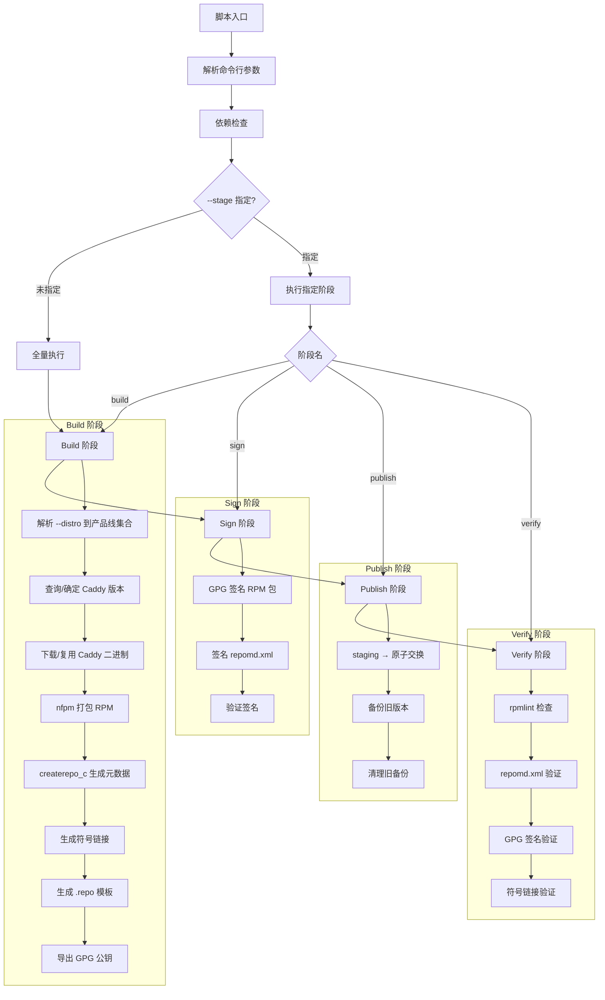
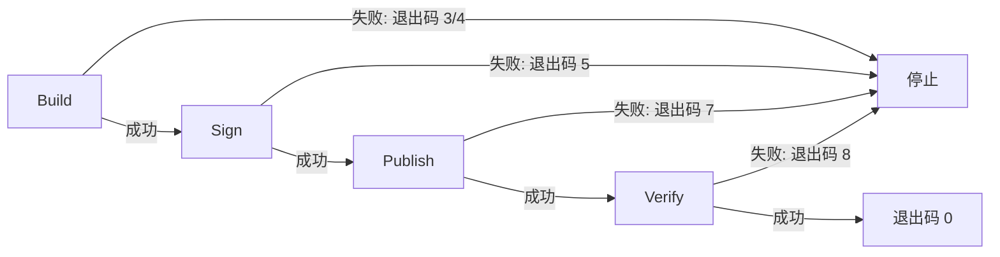

# 技术设计文档：自建 RPM 仓库构建系统（产品线架构）

## 概述

本设计描述一套基于 Bash 的自动化构建系统，核心脚本为 `build-repo.sh`，用于构建和维护自建的 RPM 仓库，为多种 Linux 发行版提供 Caddy Server 的 RPM 包分发。

### 核心设计理念

系统按**产品线（Product Line）**而非按发行版组织构建。由于 Caddy 是纯 Go 静态编译（`CGO_ENABLED=0`），同一架构的二进制文件可跨发行版复用。兼容同一 RPM 版本的发行版归入同一产品线，每个产品线每个架构仅构建一个 RPM 包。

7 条产品线：
- **EL8** — RHEL 8 系及兼容发行版（含 Alibaba Cloud Linux 3、Kylin V10）
- **EL9** — RHEL 9 系及兼容发行版（含 Anolis 23、Alibaba Cloud Linux 4、Kylin V11）
- **EL10** — RHEL 10 系及兼容发行版（CentOS Stream 10、AlmaLinux 10、Rocky Linux 10、Oracle Linux 10）
- **AL2023** — Amazon Linux 2023
- **Fedora** — Fedora 42、Fedora 43（独立产品线）
- **openEuler 22** — openEuler 22.03 LTS
- **openEuler 24** — openEuler 24.03 LTS

真实目录按产品线组织，通过符号链接提供发行版友好路径（`{distro}/{version}/`），使客户端 `.repo` 配置直觉化。

### 设计决策

- **纯 Bash 实现**：与 `install-caddy.sh` 保持一致的技术栈，无额外语言依赖
- **nfpm 打包**：无需 rpmbuild 工具链，轻量且支持 CI/CD 环境下的密钥文件签名
- **createrepo_c 生成元数据**：标准工具，兼容所有 YUM/DNF 客户端
- **产品线架构 + 符号链接**：7 产品线 × 2 架构 = 14 个 RPM 包，符号链接提供 28+ 个发行版友好路径
- **原子发布**：staging → mv 交换，零停机部署，支持回滚
- **阶段化 CI/CD**：Build → Sign → Publish → Verify，可单独执行或全量运行
- **离线构建**：`vendor/` 目录支持预下载二进制文件，适用于无外网环境

## 架构

### 整体流程



### CI/CD 流水线阶段


每个阶段可通过 `--stage` 参数单独执行，便于 CI/CD 编排。

### 目录结构

构建产物的最终目录结构：

```
{output_dir}/
  .staging/                          # 构建临时目录
  .rollback/{timestamp}/             # 回滚备份（保留最近 3 个）
  caddy/
    gpg.key                          # GPG 公钥（ASCII-armored）
    templates/                       # .repo 配置模板
      caddy-anolis-8.repo
      caddy-anolis-23.repo
      caddy-openEuler-22.repo
      ...
    el8/
      x86_64/
        Packages/
          caddy-2.9.0-1.el8.x86_64.rpm
        repodata/
          repomd.xml
          repomd.xml.asc
          primary.xml.xz
          filelists.xml.xz
          other.xml.xz
      aarch64/
        Packages/
        repodata/
    el9/
      x86_64/...
      aarch64/...
    el10/
      x86_64/...
      aarch64/...
    al2023/
      x86_64/...
      aarch64/...
    fedora/
      x86_64/...
      aarch64/...
    openeuler/
      22/
        x86_64/...
        aarch64/...
      24/
        x86_64/...
        aarch64/...
    # === 符号链接（发行版友好路径）===
    anolis/8/   → ../el8/
    anolis/23/  → ../el9/
    centos/8/   → ../el8/
    centos/9/   → ../el9/
    centos/10/  → ../el10/
    rhel/8/     → ../el8/
    rhel/9/     → ../el9/
    rhel/10/    → ../el10/
    almalinux/10/ → ../el10/
    rocky/10/   → ../el10/
    ol/10/      → ../el10/
    # Fedora: 不生成版本符号链接，客户端直接使用 caddy/fedora/{arch}/ 路径
    alinux/3/   → ../el8/
    alinux/4/   → ../el9/
    kylin/V10/  → ../el8/
    kylin/V11/  → ../el9/
    amzn/2023/  → ../al2023/
    openEuler/22/ → ../openeuler/22/
    openEuler/24/ → ../openeuler/24/
    ...
```

## 组件与接口

### 1. 产品线映射模块

产品线映射表定义为关联数组，是整个系统的核心数据结构：

```bash
# 产品线标识 → 目录路径
declare -A PRODUCT_LINE_PATHS=(
    [el8]="el8"
    [el9]="el9"
    [el10]="el10"
    [al2023]="al2023"
    [fedora]="fedora"
    [oe22]="openeuler/22"
    [oe24]="openeuler/24"
)

# 产品线标识 → RPM 包标签
declare -A PRODUCT_LINE_TAGS=(
    [el8]="el8"
    [el9]="el9"
    [el10]="el10"
    [al2023]="al2023"
    [fedora]="fc"
    [oe22]="oe22"
    [oe24]="oe24"
)

# 产品线标识 → 压缩算法
declare -A PRODUCT_LINE_COMPRESS=(
    [el8]="xz"
    [el9]="zstd"
    [el10]="zstd"
    [al2023]="zstd"
    [fedora]="zstd"
    [oe22]="zstd"
    [oe24]="zstd"
)

# 发行版 → 产品线映射（distro_id:version → product_line_id）
declare -A DISTRO_TO_PRODUCT_LINE=(
    # EL8
    [rhel:8]="el8" [centos:8]="el8" [almalinux:8]="el8" [rocky:8]="el8"
    [anolis:8]="el8" [ol:8]="el8" [opencloudos:8]="el8"
    [kylin:V10]="el8" [alinux:3]="el8"
    # EL9
    [rhel:9]="el9" [centos:9]="el9" [almalinux:9]="el9" [rocky:9]="el9"
    [anolis:23]="el9" [ol:9]="el9" [opencloudos:9]="el9"
    [kylin:V11]="el9" [alinux:4]="el9"
    # EL10
    [rhel:10]="el10" [centos:10]="el10" [almalinux:10]="el10"
    [rocky:10]="el10" [ol:10]="el10"
    # AL2023
    [amzn:2023]="al2023"
    # Fedora
    [fedora:42]="fedora" [fedora:43]="fedora"
    # openEuler
    [openEuler:22]="oe22" [openEuler:24]="oe24"
)
```

**函数接口：**

- `resolve_product_lines "$distro_spec"` — 将 `--distro` 参数值解析为产品线 ID 集合。`all` 返回全部 7 条产品线。无效的 distro:version 组合输出错误并退出码 1。
- `get_product_line_path "$pl_id"` — 返回产品线的目录路径（如 `el8`、`openeuler/22`）
- `get_product_line_tag "$pl_id"` — 返回产品线的 RPM 包标签（如 `el8`、`oe22`）
- `get_compress_type "$pl_id"` — 返回产品线的压缩算法（`xz` 或 `zstd`）

### 2. 命令行参数解析模块

```bash
# 全局变量（参数解析结果）
OPT_VERSION=""              # --version: Caddy 版本号
OPT_OUTPUT="./repo"         # --output: 仓库输出根目录
OPT_GPG_KEY_ID=""           # --gpg-key-id: GPG 密钥 ID
OPT_GPG_KEY_FILE=""         # --gpg-key-file: GPG 私钥文件路径
OPT_ARCH="all"              # --arch: x86_64 | aarch64 | all
OPT_DISTRO="all"            # --distro: distro:version,... | all
OPT_BASE_URL="https://rpms.example.com"  # --base-url: .repo 模板基础 URL
OPT_STAGE=""                # --stage: build | sign | publish | verify
OPT_ROLLBACK=false          # --rollback: 回滚到最近备份
OPT_SM2_KEY=""              # --sm2-key: SM2 私钥路径（国密产品线）
```

**函数接口：**

- `parse_args "$@"` — 解析命令行参数，设置全局变量。无效参数退出码 1。
- `parse_show_help` — 输出用法说明，退出码 0。

### 3. 依赖检查模块

**函数接口：**

- `check_dependencies` — 检查 `curl`、`nfpm`、`createrepo_c`（或 `createrepo`）、`gpg`、`rpm` 是否可用。缺失时输出工具名称和安装建议，退出码 2。
- `check_gpg_key "$key_id"` — 检查 GPG 密钥 ID 是否存在于本地密钥环。不存在时退出码 2。

### 4. 版本查询模块

**函数接口：**

- `resolve_version` — 如果 `OPT_VERSION` 为空，通过 GitHub Releases API 查询最新稳定版本。设置 `CADDY_VERSION` 全局变量。失败时退出码 3。

**API 调用：**

```bash
curl -fsSL "https://api.github.com/repos/caddyserver/caddy/releases/latest" \
    | grep '"tag_name"' | sed 's/.*"v\(.*\)".*/\1/'
```

### 5. 二进制下载模块

**函数接口：**

- `download_caddy_binary "$arch"` — 为指定架构下载 Caddy 二进制文件。优先使用 `vendor/` 目录中的本地文件。

**架构映射：**

| Target_Arch | Go Arch | vendor/ 文件名 |
|-------------|---------|---------------|
| x86_64 | amd64 | `vendor/caddy-{version}-linux-amd64` |
| aarch64 | arm64 | `vendor/caddy-{version}-linux-arm64` |

**下载 URL：**

```
https://caddyserver.com/api/download?os=linux&arch={go_arch}&version={version}
```

### 6. RPM 打包模块（nfpm）

**函数接口：**

- `build_rpm "$pl_id" "$arch"` — 为指定产品线和架构生成 RPM 包。动态生成 nfpm 配置文件。
- `generate_nfpm_config "$pl_id" "$arch"` — 生成 nfpm YAML 配置文件。

**nfpm 配置模板（关键字段）：**

```yaml
name: caddy
arch: "${arch}"
platform: linux
version: "${CADDY_VERSION}"
release: "1.${pl_tag}"
maintainer: "Caddy <https://caddyserver.com>"
description: "Caddy - powerful, enterprise-ready, open source web server"
vendor: "Caddy"
homepage: "https://caddyserver.com"
license: "Apache-2.0"

rpm:
  compression: "${compress_type}"  # xz (EL8) 或 zstd (其他)
  signature:
    key_file: "${OPT_GPG_KEY_FILE}"  # CI/CD 环境使用

contents:
  - src: "${binary_path}"
    dst: /usr/bin/caddy
    file_info:
      mode: 0755
  - src: caddy.service
    dst: /usr/lib/systemd/system/caddy.service
  - src: Caddyfile
    dst: /etc/caddy/Caddyfile
    type: config|noreplace
  - src: LICENSE
    dst: /usr/share/licenses/caddy/LICENSE
  - dst: /etc/caddy/
    type: dir
  - dst: /var/lib/caddy/
    type: dir

scripts:
  postinstall: scripts/postinstall.sh
  preremove: scripts/preremove.sh
```

**RPM 包命名：** `caddy-{version}-1.{pl_tag}.{arch}.rpm`

示例：
- `caddy-2.9.0-1.el8.x86_64.rpm`
- `caddy-2.9.0-1.el9.aarch64.rpm`
- `caddy-2.9.0-1.el10.x86_64.rpm`
- `caddy-2.9.0-1.al2023.x86_64.rpm`
- `caddy-2.9.0-1.fc.x86_64.rpm`
- `caddy-2.9.0-1.oe22.x86_64.rpm`
- `caddy-2.9.0-1.oe24.aarch64.rpm`

### 7. systemd 服务配置

`caddy.service` 文件内容：

```ini
[Unit]
Description=Caddy
Documentation=https://caddyserver.com/docs/
After=network.target network-online.target
Requires=network-online.target

[Service]
Type=notify
User=caddy
Group=caddy
ExecStart=/usr/bin/caddy run --environ --config /etc/caddy/Caddyfile
ExecReload=/usr/bin/caddy reload --config /etc/caddy/Caddyfile --force
TimeoutStopSec=5s
LimitNOFILE=1048576
LimitNPROC=512
PrivateTmp=true
ProtectSystem=full
ProtectHome=true
NoNewPrivileges=true
AmbientCapabilities=CAP_NET_BIND_SERVICE
Environment=XDG_DATA_HOME=/var/lib/caddy
Environment=XDG_CONFIG_HOME=/etc/caddy

[Install]
WantedBy=multi-user.target
```

**postinstall.sh：**

```bash
#!/bin/bash
# 创建 caddy 系统用户和组
if ! getent group caddy >/dev/null 2>&1; then
    groupadd --system caddy
fi
if ! getent passwd caddy >/dev/null 2>&1; then
    useradd --system --gid caddy --home-dir /var/lib/caddy --shell /sbin/nologin caddy
fi
systemctl daemon-reload
```

**preremove.sh：**

```bash
#!/bin/bash
systemctl stop caddy.service 2>/dev/null || true
systemctl disable caddy.service 2>/dev/null || true
```

### 8. GPG 签名模块

**函数接口：**

- `sign_rpm "$rpm_path"` — 对 RPM 包签名。优先使用 nfpm 内置签名（`rpm.signature.key_file`），回退到 `rpm --addsign`。
- `sign_repomd "$repomd_path"` — 对 `repomd.xml` 生成分离签名 `repomd.xml.asc`。
- `verify_rpm_signature "$rpm_path"` — 使用 `rpm -K` 验证 RPM 签名。
- `export_gpg_pubkey "$output_path"` — 导出 GPG 公钥到 `gpg.key`。

### 9. 仓库元数据生成模块

**函数接口：**

- `generate_repodata "$repo_dir"` — 对指定目录执行 `createrepo_c`。

**createrepo_c 调用参数：**

```bash
createrepo_c \
    --general-compress-type=xz \
    --update \
    "${repo_dir}"
```

- `--general-compress-type=xz`：确保元数据使用 xz 压缩，兼容所有产品线的 librepo
- `--update`：增量更新已有 repodata

### 10. 符号链接生成模块

**函数接口：**

- `generate_symlinks` — 遍历 `DISTRO_TO_PRODUCT_LINE` 映射表，为每个 distro:version 创建符号链接。
- `validate_symlinks` — 验证所有符号链接指向有效目标。

**符号链接使用相对路径：**

```bash
# 示例：caddy/anolis/8/ → ../../el8/ （相对于 caddy/anolis/8/）
# 实际实现：在 caddy/ 目录下
# caddy/anolis/8 → ../el8
# caddy/openEuler/22 → ../openeuler/22
```

### 11. 原子发布模块

**函数接口：**

- `atomic_publish` — staging → 原子交换（`mv`）→ 备份旧版本。
- `rollback_latest` — 恢复最近一次备份。
- `cleanup_old_backups` — 保留最近 3 个备份，清理更早的。

**发布流程：**


### 12. .repo 模板生成模块

**函数接口：**

- `generate_repo_templates` — 为每个 distro:version 生成 `.repo` 配置文件。

**模板内容：**

```ini
[caddy-selfhosted]
name=Caddy Self-Hosted Repository ({distro_name} {distro_version} - $basearch)
baseurl={base_url}/caddy/{distro_id}/{distro_version}/$basearch/
enabled=1
gpgcheck=1
repo_gpgcheck=1
gpgkey={base_url}/caddy/gpg.key
# 如需 SELinux 支持，请安装 caddy-selinux 子包：
# dnf install caddy-selinux
```

Fedora 特殊处理：由于 Fedora 产品线不使用版本子目录，Fedora 的 .repo 模板 baseurl 格式为 `{base_url}/caddy/fedora/$basearch/`（不含版本号）。

### 13. 验证测试模块

**函数接口：**

- `verify_rpmlint` — 对每个 RPM 包执行 `rpmlint`。
- `verify_repodata` — 验证 `repomd.xml` 存在且格式正确。
- `verify_signatures` — 验证 RPM 签名和 `repomd.xml.asc`。
- `verify_symlinks` — 验证所有符号链接有效。

### 14. install-caddy.sh 联动更新

需要修改 `install-caddy.sh` 中的以下函数以适配产品线架构：

**`detect_classify` 变更：** 新增 `OS_MAJOR_VERSION` 全局变量，存储发行版原生主版本号。

```bash
# 新增全局变量
OS_MAJOR_VERSION=""  # 发行版原生主版本号

# detect_classify 中设置 OS_MAJOR_VERSION
case "$OS_ID" in
    openEuler)
        OS_MAJOR_VERSION="$major_version"  # 22 或 24
        ;;
    anolis)
        OS_MAJOR_VERSION="$major_version"  # 8 或 23
        ;;
    alinux)
        OS_MAJOR_VERSION="$major_version"  # 3 或 4
        ;;
    kylin)
        # VERSION_ID 可能是 "V10" 或 "V11"
        if [[ "$OS_VERSION_ID" == *V10* ]]; then
            OS_MAJOR_VERSION="V10"
        elif [[ "$OS_VERSION_ID" == *V11* ]]; then
            OS_MAJOR_VERSION="V11"
        fi
        ;;
    *)
        OS_MAJOR_VERSION="$major_version"
        ;;
esac
```

**`_generate_dnf_repo_content` 变更：** 使用发行版友好路径替代 EPEL 版本路径。

```bash
_generate_dnf_repo_content() {
    local base_url="$1"
    local distro_id="$2"       # OS_ID
    local distro_version="$3"  # OS_MAJOR_VERSION
    local arch="$4"            # OS_ARCH_RAW

    cat <<EOF
[caddy-selfhosted]
name=Caddy Self-Hosted Repository (${OS_NAME} ${distro_version} - ${arch})
baseurl=${base_url}/caddy/${distro_id}/${distro_version}/\$basearch/
enabled=1
gpgcheck=1
repo_gpgcheck=1
gpgkey=${base_url}/caddy/gpg.key
EOF
}
```

### 15. vendor-download.sh 辅助脚本

**函数接口：**

- 接受 `--version <VERSION>` 参数
- 为 x86_64（amd64）和 aarch64（arm64）下载 Caddy 二进制文件到 `vendor/` 目录
- 文件命名：`vendor/caddy-{version}-linux-{go_arch}`

### 16. SELinux 子包（可选）

`caddy-selinux` 作为独立 RPM 子包构建：
- postinstall：`semodule -i /usr/share/selinux/packages/caddy.pp`
- preremove：`semodule -r caddy`
- 主包 `caddy` 不依赖此子包

### 17. 国密产品线（可选）

当 `--sm2-key` 参数提供时：
- 使用 SM2 密钥签名 RPM 包
- 使用 SM3 摘要算法
- 输出到独立目录 `{output_dir}/caddy-sm/`
- 生成独立的 `gpg-sm2.key` 公钥文件

## 数据模型

本项目为纯 Bash 脚本，核心数据结构为全局 Shell 变量和关联数组。

### 全局状态变量

```bash
# === 参数解析结果 ===
OPT_VERSION=""              # Caddy 版本号
OPT_OUTPUT="./repo"         # 仓库输出根目录
OPT_GPG_KEY_ID=""           # GPG 密钥 ID
OPT_GPG_KEY_FILE=""         # GPG 私钥文件路径
OPT_ARCH="all"              # 目标架构
OPT_DISTRO="all"            # 目标发行版
OPT_BASE_URL="https://rpms.example.com"  # .repo 模板基础 URL
OPT_STAGE=""                # CI/CD 阶段
OPT_ROLLBACK=false          # 回滚标志
OPT_SM2_KEY=""              # SM2 私钥路径

# === 运行时状态 ===
CADDY_VERSION=""            # 最终确定的 Caddy 版本号
TARGET_ARCHS=()             # 目标架构列表
TARGET_PRODUCT_LINES=()     # 目标产品线列表
STAGING_DIR=""              # staging 目录路径
BUILD_START_TIME=""         # 构建开始时间
RPM_COUNT=0                 # 生成的 RPM 包计数
SYMLINK_COUNT=0             # 生成的符号链接计数
```

### 退出码定义

| 退出码 | 含义 | 触发场景 |
|--------|------|---------|
| 0 | 成功 | 构建完成或回滚成功 |
| 1 | 参数错误 | 无效参数、无效 distro:version |
| 2 | 依赖缺失 | 工具不可用、GPG 密钥不存在 |
| 3 | 下载/版本查询失败 | curl 失败、API 错误、文件大小为 0 |
| 4 | 打包失败 | nfpm 执行失败 |
| 5 | 签名失败 | GPG 签名失败、签名验证失败、密钥导出失败 |
| 6 | 元数据生成失败 | createrepo_c 执行失败 |
| 7 | 发布/回滚失败 | 原子交换失败、回滚失败 |
| 8 | 验证测试失败 | rpmlint 失败、签名验证失败 |

### 产品线映射数据

完整的 distro:version → product_line 映射关系（28 个映射条目）：

| distro_id | version | product_line | 目录路径 |
|-----------|---------|-------------|---------|
| rhel | 8 | el8 | el8/ |
| centos | 8 | el8 | el8/ |
| almalinux | 8 | el8 | el8/ |
| rocky | 8 | el8 | el8/ |
| anolis | 8 | el8 | el8/ |
| ol | 8 | el8 | el8/ |
| opencloudos | 8 | el8 | el8/ |
| kylin | V10 | el8 | el8/ |
| alinux | 3 | el8 | el8/ |
| rhel | 9 | el9 | el9/ |
| centos | 9 | el9 | el9/ |
| almalinux | 9 | el9 | el9/ |
| rocky | 9 | el9 | el9/ |
| anolis | 23 | el9 | el9/ |
| ol | 9 | el9 | el9/ |
| opencloudos | 9 | el9 | el9/ |
| kylin | V11 | el9 | el9/ |
| alinux | 4 | el9 | el9/ |
| rhel | 10 | el10 | el10/ |
| centos | 10 | el10 | el10/ |
| almalinux | 10 | el10 | el10/ |
| rocky | 10 | el10 | el10/ |
| ol | 10 | el10 | el10/ |
| fedora | 42 | fedora | fedora/ |
| fedora | 43 | fedora | fedora/ |
| amzn | 2023 | al2023 | al2023/ |
| openEuler | 22 | oe22 | openeuler/22/ |
| openEuler | 24 | oe24 | openeuler/24/ |


## 正确性属性（Correctness Properties）

*属性（Property）是系统在所有有效执行中都应保持为真的特征或行为——本质上是对系统应做什么的形式化陈述。属性是人类可读规范与机器可验证正确性保证之间的桥梁。*

### Property 1: 产品线映射正确性

*For any* 有效的 `distro_id:version` 组合（来自 Product_Line_Map 中的 28 个条目），`resolve_product_lines` 函数应返回正确的产品线 ID；*For any* 不在映射表中的 `distro_id:version` 组合，函数应以退出码 1 终止。

**Validates: Requirements 1.1, 1.3, 1.4**

### Property 2: 命令行参数解析正确性

*For any* 有效的命令行参数组合（`--version`、`--output`、`--gpg-key-id`、`--gpg-key-file`、`--arch`、`--distro`、`--base-url`、`--stage`、`--sm2-key`），`parse_args` 函数应正确设置对应的全局变量；*For any* 未知参数字符串，`parse_args` 应以退出码 1 终止；`--arch` 参数仅接受 `x86_64`、`aarch64` 或 `all`。

**Validates: Requirements 2.1, 2.2, 2.3, 2.4, 2.5, 2.6, 2.8, 20.2**

### Property 3: 依赖检查正确性

*For any* 必要工具（`curl`、`nfpm`、`createrepo_c`/`createrepo`、`gpg`、`rpm`）的可用性子集，`check_dependencies` 函数应准确报告所有缺失的工具名称，并在任一工具缺失时以退出码 2 终止。

**Validates: Requirements 3.1, 3.2**

### Property 4: vendor/ 目录二进制文件查找

*For any* 版本号和架构组合，当 `vendor/caddy-{version}-linux-{go_arch}` 文件存在时，`download_caddy_binary` 应使用本地文件而非发起网络下载；当文件不存在时，应从 Caddy_API 下载。

**Validates: Requirements 4.1, 4.2**

### Property 5: 下载 URL 构造正确性

*For any* 目标架构（`x86_64` → `amd64`、`aarch64` → `arm64`）和版本号组合，构造的下载 URL 应为 `https://caddyserver.com/api/download?os=linux&arch={go_arch}&version={version}`。

**Validates: Requirements 5.1, 5.2**

### Property 6: 每架构仅下载一次

*For any* 产品线集合和架构，同一架构的 Caddy 二进制文件应仅下载一次，在所有产品线间复用。

**Validates: Requirements 5.6**

### Property 7: RPM 包数量正确性

*For any* 目标产品线集合（大小为 N）和目标架构集合（大小为 M），生成的 RPM 包总数应恰好为 N × M。

**Validates: Requirements 6.2**

### Property 8: RPM 文件名格式正确性

*For any* 版本号、产品线标签和架构组合，生成的 RPM 文件名应严格匹配格式 `caddy-{version}-1.{pl_tag}.{arch}.rpm`。

**Validates: Requirements 6.3**

### Property 9: nfpm 配置完整性

*For any* 产品线和架构组合，动态生成的 nfpm 配置应包含：二进制文件安装到 `/usr/bin/caddy`、systemd 服务文件安装到 `/usr/lib/systemd/system/caddy.service`、默认配置文件 `/etc/caddy/Caddyfile`（类型为 `config|noreplace`）、LICENSE 文件安装到 `/usr/share/licenses/caddy/LICENSE`、目录条目 `/etc/caddy/` 和 `/var/lib/caddy/`、以及 postinstall 和 preremove 生命周期脚本。

**Validates: Requirements 6.4, 6.5, 6.6, 6.7, 6.8, 6.10, 6.11**

### Property 10: 压缩算法映射正确性

*For any* 产品线 ID，`get_compress_type` 应返回正确的压缩算法：EL8 返回 `xz`，EL9、EL10、AL2023、Fedora、openEuler 22、openEuler 24 返回 `zstd`。

**Validates: Requirements 6.9**

### Property 11: 仓库目录结构正确性

*For any* 产品线和架构组合，签名后的 RPM 包应放置在 `{output_dir}/caddy/{pl_path}/{arch}/Packages/` 目录中。

**Validates: Requirements 10.1, 10.2**

### Property 12: repodata 生成与验证

*For any* 产品线和架构目录，执行 `createrepo_c` 后应在该目录下生成 `repodata/repomd.xml` 文件。

**Validates: Requirements 10.3, 10.7**

### Property 13: 符号链接生成正确性

*For any* Product_Line_Map 中的 `distro_id:version` 条目，应在 `{output_dir}/caddy/{distro_id}/{version}/` 创建符号链接，指向对应产品线目录；符号链接应使用相对路径；符号链接目标应为有效目录。

**Validates: Requirements 11.1, 11.2, 11.3, 11.4**

### Property 14: .repo 模板生成正确性

*For any* `distro_id:version` 和 `base_url` 组合，生成的 `.repo` 模板文件应：命名为 `caddy-{distro_id}-{version}.repo`；`baseurl` 使用发行版友好路径格式 `{base_url}/caddy/{distro_id}/{version}/$basearch/`；包含 `gpgcheck=1`、`repo_gpgcheck=1` 和正确的 `gpgkey` URL。

**Validates: Requirements 13.1, 13.2, 13.3, 13.4, 13.5**

### Property 15: 回滚备份保留策略

*For any* 数量的回滚备份，系统应仅保留最近 3 个备份，自动清理更早的备份。

**Validates: Requirements 12.6**

### Property 16: 幂等性

*For any* 相同的输入参数，重复执行构建脚本应产生相同的仓库目录结构；当目标目录中已存在相同版本的 RPM 包时，应跳过下载和打包步骤。

**Validates: Requirements 15.1, 15.2**

### Property 17: CI/CD 阶段控制

*For any* 有效的 `--stage` 参数值（`build`、`sign`、`publish`、`verify`），仅对应阶段应被执行；每个阶段完成后应输出 `[STAGE] {stage_name}: completed` 到 stderr。

**Validates: Requirements 16.1, 16.3**

### Property 18: 日志输出规范性

*For any* 构建执行，所有日志信息应输出到 stderr（不污染 stdout）；每个主要步骤应有 `[INFO]` 级别日志；失败时应有 `[ERROR]` 级别日志；stdout 仅输出最终仓库根目录绝对路径。

**Validates: Requirements 18.1, 18.3, 18.4**

### Property 19: 退出码映射正确性

*For any* 错误类别，脚本的退出码应与定义的映射一致：成功→0、参数错误→1、依赖缺失→2、下载失败→3、打包失败→4、签名失败→5、元数据失败→6、发布失败→7、验证失败→8。

**Validates: Requirements 18.2**

### Property 20: 版本号提取正确性

*For any* GitHub API 返回的 `tag_name` 字符串（格式为 `vX.Y.Z`），版本提取逻辑应正确去除 `v` 前缀，返回 `X.Y.Z`。

**Validates: Requirements 14.2**

### Property 21: install-caddy.sh _generate_dnf_repo_content 输出正确性

*For any* `OS_ID`、`OS_MAJOR_VERSION`、`arch` 和 `base_url` 组合，`_generate_dnf_repo_content` 生成的 `.repo` 内容应：`baseurl` 使用 `{base_url}/caddy/{OS_ID}/{OS_MAJOR_VERSION}/$basearch/` 格式；包含 `repo_gpgcheck=1`；`name` 字段包含发行版名称和版本号（非产品线名称）。

**Validates: Requirements 19.1, 19.3, 19.4, 19.5**

### Property 22: install-caddy.sh OS_MAJOR_VERSION 设置正确性

*For any* 支持的发行版 `OS_ID` 和 `OS_VERSION_ID` 组合，`detect_classify` 函数应正确设置 `OS_MAJOR_VERSION` 为发行版原生主版本号（如 Anolis 的 `8` 或 `23`，openEuler 的 `22` 或 `24`，Kylin 的 `V10` 或 `V11`，Alibaba Cloud Linux 的 `3` 或 `4`）。

**Validates: Requirements 19.2**

## 错误处理

### 错误分类与处理策略

| 错误类别 | 退出码 | 处理策略 |
|---------|--------|---------|
| 无效命令行参数 | 1 | 输出错误信息和用法提示到 stderr，立即终止 |
| 无效 distro:version | 1 | 输出错误信息到 stderr，列出有效的映射，立即终止 |
| 工具依赖缺失 | 2 | 输出缺失工具名称和安装建议到 stderr，立即终止 |
| GPG 密钥不存在 | 2 | 输出错误信息到 stderr，立即终止 |
| 版本查询失败 | 3 | 输出 API 错误信息到 stderr，立即终止 |
| 二进制下载失败 | 3 | 输出 HTTP 状态码或 curl 错误码到 stderr，立即终止 |
| 下载文件大小为 0 | 3 | 删除无效文件，输出错误到 stderr，立即终止 |
| nfpm 打包失败 | 4 | 输出 nfpm 错误输出到 stderr，立即终止 |
| GPG 签名失败 | 5 | 输出签名错误信息到 stderr，立即终止 |
| 签名验证失败 | 5 | 输出验证失败的 RPM 文件名到 stderr，立即终止 |
| GPG 公钥导出失败 | 5 | 输出错误信息到 stderr，立即终止 |
| createrepo_c 失败 | 6 | 输出 createrepo 错误输出到 stderr，立即终止 |
| 原子交换失败 | 7 | 保留 staging 目录不删除，输出错误到 stderr，立即终止 |
| 回滚失败 | 7 | 输出错误信息到 stderr，立即终止 |
| rpmlint 检查失败 | 8 | 输出失败的测试项和详细信息到 stderr，立即终止 |
| 符号链接验证失败 | 8 | 输出无效链接列表到 stderr，立即终止 |
| openEuler 20 不支持 | — | 输出警告到 stderr，不终止（仅跳过） |
| 符号链接目标不存在 | — | 输出警告到 stderr，跳过该链接 |
| SIGINT/SIGTERM | 非零 | 清理临时文件和 staging 目录后退出 |

### 信号处理

```bash
trap cleanup EXIT
trap 'util_log_error "收到中断信号，正在清理..."; exit 130' INT TERM
```

`cleanup` 函数负责：
1. 删除临时目录中的中间文件
2. 如果 staging 目录存在且未完成发布，保留 staging 目录（便于调试）

### 阶段失败传播



## 测试策略

### 测试框架选择

- **单元测试**：使用 [bats-core](https://github.com/bats-core/bats-core)（与现有 `install-caddy.sh` 测试保持一致）
- **属性测试**：使用 bats-core 配合自定义随机数据生成器实现属性测试循环

> 注：由于 Bash 生态缺乏原生的属性测试（Property-Based Testing）库，我们采用 bats-core 测试框架，在每个属性测试中通过循环生成随机输入并验证属性。每个属性测试至少运行 100 次迭代。这与现有 `install-caddy.sh` 的测试方式一致。

### 测试组织

```
tests/
├── test_helper/
│   ├── generators.bash          # 现有生成器（扩展）
│   ├── generators_repo.bash     # 新增：仓库构建系统专用生成器
│   └── mock_helpers.bash        # 现有 mock 工具（扩展）
├── unit/
│   ├── ... (现有测试)
│   ├── test_product_line_map.bats      # 产品线映射单元测试
│   ├── test_build_parse_args.bats      # build-repo.sh 参数解析
│   ├── test_dependency_check.bats      # 依赖检查
│   ├── test_version_query.bats         # 版本查询
│   ├── test_nfpm_config.bats           # nfpm 配置生成
│   ├── test_symlink_generation.bats    # 符号链接生成
│   ├── test_repo_template.bats         # .repo 模板生成
│   ├── test_atomic_publish.bats        # 原子发布
│   └── test_install_caddy_update.bats  # install-caddy.sh 联动更新
└── property/
    ├── ... (现有测试)
    ├── test_prop_product_line.bats     # Property 1: 产品线映射
    ├── test_prop_build_args.bats       # Property 2: 参数解析
    ├── test_prop_dep_check.bats        # Property 3: 依赖检查
    ├── test_prop_vendor_lookup.bats    # Property 4: vendor/ 查找
    ├── test_prop_download_url.bats     # Property 5: 下载 URL
    ├── test_prop_arch_dedup.bats       # Property 6: 架构去重
    ├── test_prop_rpm_count.bats        # Property 7: RPM 数量
    ├── test_prop_rpm_filename.bats     # Property 8: RPM 文件名
    ├── test_prop_nfpm_config.bats      # Property 9: nfpm 配置
    ├── test_prop_compress.bats         # Property 10: 压缩算法
    ├── test_prop_repo_dir.bats         # Property 11: 目录结构
    ├── test_prop_repodata.bats         # Property 12: repodata
    ├── test_prop_symlinks.bats         # Property 13: 符号链接
    ├── test_prop_repo_template.bats    # Property 14: .repo 模板
    ├── test_prop_backup_retention.bats # Property 15: 备份保留
    ├── test_prop_idempotent.bats       # Property 16: 幂等性
    ├── test_prop_stage_control.bats    # Property 17: 阶段控制
    ├── test_prop_log_stderr.bats       # Property 18: 日志输出
    ├── test_prop_exit_codes_repo.bats  # Property 19: 退出码
    ├── test_prop_version_extract.bats  # Property 20: 版本提取
    ├── test_prop_dnf_repo_content.bats # Property 21: DNF repo 内容
    └── test_prop_os_major_ver.bats     # Property 22: OS_MAJOR_VERSION
```

### 随机数据生成器（generators_repo.bash）

新增生成器用于仓库构建系统的属性测试：

```bash
# 产品线 ID 列表
KNOWN_PRODUCT_LINES=(el8 el9 el10 al2023 fedora oe22 oe24)

# 有效的 distro:version 对
KNOWN_DISTRO_VERSIONS=(
    "rhel:8" "centos:8" "almalinux:8" "rocky:8" "anolis:8"
    "ol:8" "opencloudos:8" "kylin:V10" "alinux:3"
    "rhel:9" "centos:9" "almalinux:9" "rocky:9" "anolis:23"
    "ol:9" "opencloudos:9" "kylin:V11" "alinux:4"
    "rhel:10" "centos:10" "almalinux:10" "rocky:10" "ol:10"
    "fedora:42" "fedora:43"
    "amzn:2023"
    "openEuler:22" "openEuler:24"
)

# 生成随机的有效 distro:version
gen_valid_distro_version()
# 生成随机的无效 distro:version
gen_invalid_distro_version()
# 生成随机的产品线 ID
gen_product_line_id()
# 生成随机的 Caddy 版本号
gen_caddy_version_number()
# 生成随机的 --distro 参数值（逗号分隔列表）
gen_distro_spec()
# 生成随机的 base_url
gen_base_url()
# 生成随机的 GPG 密钥 ID
gen_gpg_key_id()
# 生成随机的 --stage 参数值
gen_stage_name()
```

### 单元测试覆盖

单元测试聚焦于具体示例、边界情况和错误条件：

- **产品线映射**：每个 distro:version 的具体映射结果、openEuler 20 警告
- **参数解析**：各参数的正确解析、默认值、`--help` 输出、`--rollback` 标志
- **依赖检查**：各工具存在/缺失的组合、GPG 密钥存在/不存在
- **版本查询**：API 响应解析、v 前缀去除、网络失败处理
- **nfpm 配置**：systemd 服务文件内容验证（User=caddy、AmbientCapabilities 等）
- **符号链接**：相对路径验证、目标不存在时的警告
- **原子发布**：staging → 交换流程、回滚恢复、交换失败保留 staging
- **.repo 模板**：SELinux 安装说明、name 字段格式
- **install-caddy.sh 更新**：OS_MAJOR_VERSION 设置、repo_gpgcheck=1

### 属性测试覆盖

每个属性测试对应设计文档中的一个 Correctness Property，通过循环 100 次随机输入验证：

- 每个测试文件头部注释标注对应的属性编号和描述
- 标签格式：`# Feature: selfhosted-rpm-repo-builder, Property {N}: {property_text}`
- 随机数据生成器在 `test_helper/generators_repo.bash` 中集中管理

### 测试执行

```bash
# 运行所有测试
bats tests/

# 仅运行仓库构建系统的单元测试
bats tests/unit/test_product_line_map.bats tests/unit/test_build_parse_args.bats ...

# 仅运行仓库构建系统的属性测试
bats tests/property/test_prop_product_line.bats tests/property/test_prop_build_args.bats ...
```

### 测试隔离策略

- 所有文件系统操作使用临时目录（`mktemp -d`），测试后清理
- 通过 `PATH` 操作和 wrapper 函数 mock 外部命令（`nfpm`、`createrepo_c`、`gpg`、`rpm`、`rpmlint`、`curl`）
- 每个测试用例独立设置和清理全局变量
- 不依赖真实的网络连接、GPG 密钥环或包管理器
- `build-repo.sh` 采用与 `install-caddy.sh` 相同的 `_SOURCED_FOR_TEST` 模式，支持 source 后单独测试函数
